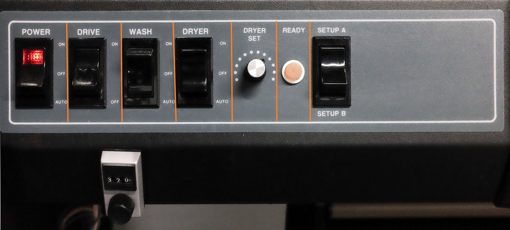

# Kreonite

## Processor Startup

* Flip main power switch on dark room wall
* On processor control panel switch power to `On`
* Switch drive to `On`
* Switch wash to `Auto`
* Dryer is set to `Off` for fiber and to `Auto` for RC

* Top off developer and fixer with water to compensate for evaporation overnight. Be careful to not splash fixer into developer

* Wash water needs to be set at water panel to 2.5gps.
 

* Check replenisher levels. If low, mix more chemicals. 
    * Mix chemicals in 20L jugs then pour into canisters. Jugs are labeled. **Do not mix fixer in the dev jug and vice versa**
    * Developer is mixed at 1:4 and Fixer is 1:9

* Close lid
* When the **Ready** light on control panel is illuminated half brightness processor is 1ºF from temp. When light is full brightness processor is up to temp at 77ºF.

## Specifications
* **Chemistry Temperature:** 77°F
* **Specific Gravity:** 1.040 ± 0.002
* **Speed Setting:** 320
* **Developer time:** 2:08
* **Fixer time:**
* **Total processing time:** 17:00
* **Transport speed:** 15.25in/min

---

## Shutdown

### Processor Shutdown

#### Weekday Shutdown
* On processor control panel switch power to `Off`
* Pull down power switch located on darkroom wall off

#### Weekend Shutdown
* On processor control panel switch power to `Off`
* Flip main power switch located on darkroom wall off
* Drain all 4 wash tanks
